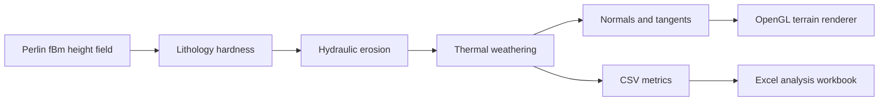

# Terrain Generation & Erosion Lab

[](https://github.com/ShkilArtem/Terrain_generation/actions/workflows/build.yml)
[](https://isocpp.org/)
[](https://www.khronos.org/opengl/)
[](LICENSE)

An interactive C++/OpenGL laboratory for generating mountain terrain, applying
hydraulic and thermal erosion, visualizing the result, and exporting
reproducible measurements for analysis.

## Highlights

- Multi-octave Perlin noise (fBm) with live amplitude, frequency, octave,
  persistence, lacunarity, height-power, and offset controls.
- Droplet-based hydraulic erosion with sediment transport, evaporation,
  deposition, and lithology-dependent hardness.
- Thermal weathering with configurable talus angle and material strength.
- PBR-style grass, rock, and snow blending with normal, roughness, and ambient
  occlusion maps.
- Signed erosion/deposition heatmap.
- Repeatable parameter sweeps using a fixed random seed.
- CSV export of timings, memory estimates, displaced volume, path length,
  slope histograms, and hypsometric curves.
- Python report generator that turns exported CSV data into a multi-sheet Excel
  workbook with charts and comparisons.

## Processing pipeline



## Requirements

- A C++17 compiler.
- CMake 3.21 or newer.
- A GPU and driver supporting OpenGL 3.3 Core.
- GLFW 3.3 or newer.

The repository already contains GLAD, GLM, Dear ImGui, stb_image, and a
prebuilt x64 GLFW 3.4 library for MSVC. On other platforms, CMake first looks
for a system GLFW package and can fetch GLFW 3.4 automatically as a fallback.

## Build and run

### Windows

Install Visual Studio 2022 or newer with the **Desktop development with C++**
workload. The included script automatically finds Visual Studio and uses its
matching CMake, so it also works from an ordinary PowerShell window:

```powershell
git clone https://github.com/ShkilArtem/Terrain_generation.git
cd Terrain_generation
.\build-windows.cmd
.\build\windows-x64\bin\Release\TerrainGeneration.exe
```

You can also open the repository as a CMake folder in Visual Studio. The
checked-in `Terrain_try.sln` remains available for the original Visual Studio
workflow.

> Running `cmake -S . -B build` from an ordinary PowerShell window can select
> `NMake Makefiles` when the active CMake installation does not match the
> installed Visual Studio version. Use `build-windows.cmd`, or run CMake from
> the matching Developer PowerShell for Visual Studio.

### Ubuntu / Debian

```bash
sudo apt-get update
sudo apt-get install build-essential cmake libglfw3-dev libgl1-mesa-dev

git clone https://github.com/ShkilArtem/Terrain_generation.git
cd Terrain_generation
cmake -S . -B build -DCMAKE_BUILD_TYPE=Release
cmake --build build --parallel
./build/bin/TerrainGeneration
```

If GLFW is not installed, omit `libglfw3-dev`; CMake will download the official
GLFW 3.4 sources during configuration. Disable this fallback with
`-DTERRAIN_FETCH_GLFW=OFF`.

### macOS

```bash
brew install cmake glfw
cmake -S . -B build -DCMAKE_BUILD_TYPE=Release
cmake --build build --parallel
./build/bin/TerrainGeneration
```

## Controls

| Input | Action |
| --- | --- |
| `W`, `A`, `S`, `D` | Move the camera |
| Hold right mouse button | Capture the cursor and look around |
| Release right mouse button | Free the cursor for the ImGui controls |
| Window close button | Exit |

The **Terrain Controls** window edits terrain shape, erosion, visualization,
material thresholds, and lighting. The **Geological Analysis & Parameter
Sweep** window runs controlled experiments over evaporation, initial water,
inertia, capacity scale, or iteration count.

## Benchmark and Excel workflow

CSV and Excel files are generated under `outputs/benchmark_results/` and are
intentionally excluded from Git.

1. In the application, click **Run Benchmark & Export CSV** for one run, or
   **Execute Automated Parameter Sweep** for a series.
2. Create a Python environment and install the report dependency:

   ```powershell
   python -m venv .venv
   .\.venv\Scripts\Activate.ps1
   python -m pip install -r requirements.txt
   ```

3. Generate the default sweep report:

   ```powershell
   python tools/generate_benchmark_excel.py
   ```

   Or pass any compatible CSV explicitly:

   ```powershell
   python tools/generate_benchmark_excel.py outputs/benchmark_results/terrain_metrics_v2.csv
   ```

The generated workbook is written next to its input CSV.

## Create a distributable package

```powershell
cmake --install build/windows-x64 --config Release --prefix dist
cpack --config build/windows-x64/CPackConfig.cmake -C Release
```

The installed directory and ZIP package contain the executable, shaders,
textures, README, license, and third-party notices.

## Repository layout

```text
.
├── main.cpp, Terrain.*, Camera.*, Shader.*
├── shaders/                 GLSL 3.30 terrain shaders
├── textures/                Grass, rock, and snow PBR maps
├── dependencies/            Vendored headers, Dear ImGui, and MSVC GLFW
├── tools/                   CSV-to-Excel analysis utility
├── CMakeLists.txt           Portable build and packaging definition
└── .github/workflows/       Continuous integration
```

## Dependencies and assets

Third-party code and texture assets retain their own licenses. The included
ambientCG and Poly Haven textures are CC0. See
[THIRD_PARTY_NOTICES.md](THIRD_PARTY_NOTICES.md) for exact sources and
licensing notes.

## License

Project source code is available under the [MIT License](LICENSE).
